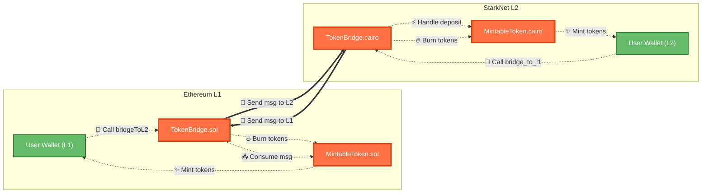

# 🌉 Ethereum ↔ Starknet Token Bridging

A full-stack implementation of token bridging between **Ethereum (L1)** and **Starknet (L2)** using Solidity and Cairo 1.0.

---

## 🔎 What is Bridging?

> Bridging moves token *representation* between blockchains — not actual tokens.

In this project:

* **L1**: Ethereum Mainnet — handles original tokens
* **L2**: Starknet — scalable ZK-rollup that mirrors tokens

### Why?

* 🚀 **Scalability**: L2 is faster & cheaper
* 🔄 **Interoperability**: Seamlessly move assets across chains
* 🔗 **Access**: DeFi apps live on both L1 and L2

---

## 🧠 How Bridging Works

> Bridging is a **Lock & Mint / Burn & Unlock** process

### L1 → L2 (Deposit)

1. Burn tokens on Ethereum (L1)
2. Send message to Starknet (L2)
3. Mint tokens on L2

### L2 → L1 (Withdraw)

1. Burn tokens on Starknet (L2)
2. Send message to Ethereum (L1)
3. Mint tokens on L1

---

## 📊 Bridging Flowchart



---

## 🏗️ Architecture Overview

```
┌─────────────────┐    Messaging     ┌────────────────────┐
│   Ethereum L1   │ ◄──────────────►│    Starknet L2     │
│                 │                 │                    │
│ TokenBridge.sol │                 │ TokenBridge.cairo  │
│ MintableToken   │                 │ MintableToken.cairo│
└─────────────────┘                 └────────────────────┘
```

---

## 🔩 Components

### 📦 Tokens

* ERC20 token on L1
* Mintable token on L2

### 🔗 Bridge Contracts

* Solidity-based bridge on L1
* Cairo-based bridge on L2

### 📬 Messaging

* `sendMessageToL2` on L1
* `send_message_to_l1_syscall` on L2

---

## 🧪 Bridging Outputs

| Preview                                                                              | Caption                                      |
| ------------------------------------------------------------------------------------ | -------------------------------------------- |
|  | **Figure 1**: Bridging Tokens to L2 from L1  |
|  | **Figure 2**: Tokens Received on Starknet L2 |
|  | **Figure 3**: Tokens Reflected in Wallet     |
|  | **Figure 4**: Bridging Back to Ethereum      |
|  | **Figure 5**: Final Confirmation on L1       |

---

## ⚙️ Core Functions

### 📤 L2 → L1 Withdrawal

```cairo
fn bridge_to_l1(ref self: ContractState, l1_recipient: EthAddress, amount: u256) {
    // Burn on L2
    IMintableTokenDispatcher { contract_address: self.l2_token.read() }
        .burn(caller_address, amount);

    // Message L1
    let mut payload: Array<felt252> = array![
        l1_recipient.into(), amount.low.into(), amount.high.into(),
    ];
    syscalls::send_message_to_l1_syscall(self.l1_bridge.read(), payload.span()).unwrap_syscall();
}
```

### 📥 L1 → L2 Deposit Handler

```cairo
#[l1_handler]
pub fn handle_deposit(ref self: ContractState, from_address: felt252, account: ContractAddress, amount: u256) {
    assert(from_address == self.l1_bridge.read(), Errors::EXPECTED_FROM_BRIDGE_ONLY);
    IMintableTokenDispatcher { contract_address: self.l2_token.read() }.mint(account, amount);
}
```

### 🧨 L1 Deposit to L2

```solidity
function bridgeToL2(uint256 recipientAddress, uint256 amount) external payable {
    token.burn(msg.sender, amount);
    (uint128 low, uint128 high) = splitUint256(amount);

    uint256[] memory payload = new uint256[](3);
    payload[0] = recipientAddress;
    payload[1] = low;
    payload[2] = high;

    snMessaging.sendMessageToL2{value: msg.value}(
        l2Bridge,
        l2HandlerSelector,
        payload
    );
}
```

### ✅ L1 Consumes Withdrawal

```solidity
function consumeWithdrawal(uint256 fromAddress, address recipient, uint128 low, uint128 high) external {
    uint256[] memory payload = new uint256[](3);
    payload[0] = uint256(uint160(recipient));
    payload[1] = uint256(low);
    payload[2] = uint256(high);

    snMessaging.consumeMessageFromL2(fromAddress, payload);
    uint256 amount = (uint256(high) << 128) | uint256(low);
    token.mint(recipient, amount);
}
```

---

## 📐 Serialization: `uint256` in Cairo

```solidity
function splitUint256(uint256 value) private pure returns (uint128 low, uint128 high) {
    low = uint128(value & 0xFFFFFFFFFFFFFFFFFFFFFFFFFFFFFFFF);
    high = uint128(value >> 128);
}
```

```cairo
// Recombined using u256 struct in Cairo
let amount = u256_from_words(low, high);
```

---

## 🛠️ Dev Tips & Best Practices

* ✅ Always validate source: `assert(from_address == self.l1_bridge.read())`
* 🔐 Mint/burn permissions must be tightly controlled
* 💡 Emit events for all cross-chain state changes
* ⏳ L2 → L1 may require hours (proof generation)

---

## 🧪 Testing Strategy

* Unit test: mint/burn, serialization, access control
* Integration test: complete bridge cycle
* Failure test: invalid selectors, mismatched amounts

---

## ⚠️ Gotchas

* ❌ L2 → L1 messages aren't auto-processed: user must call `consumeWithdrawal`
* ⚙️ Use `uint128` chunks for all messaging payloads
* 🚨 L1 handler selector mismatch will silently fail

---

## 📚 Conclusion

This repo shows how to bridge ERC20-like tokens securely between Ethereum and Starknet using minimal, composable smart contracts. You can extend it with:

* zk-proof verification for withdrawals
* on-chain receipts and history
* batch bridging

PRs & stars welcome ⭐
